# ParseHawk

<p align="center">
  <picture>
    <source media="(prefers-color-scheme: light)" srcset="https://raw.githubusercontent.com/parsehawk/parsehawk/main/apps/web/src/assets/logo.svg">
    
  </picture>
</p>

<p align="center">
  <strong>Turn documents into structured JSON with local-first document AI.</strong>
  <br>
  <strong>Run 100% locally by default, with API, CLI, and Web UI.</strong>
</p>

<p align="center">
  <a href="https://docs.parsehawk.com"><strong>Developer docs</strong></a> ·
  <a href="https://docs.parsehawk.com/tutorials/first-extraction/">Quickstart tutorial</a> ·
  <a href="https://docs.parsehawk.com/reference/api/">API reference</a> ·
  <a href="#community">Community</a>
</p>

<p align="center">
  <a href="https://github.com/parsehawk/parsehawk/releases"></a>
  <a href="LICENSE"></a>
  <a href="pyproject.toml"></a>
  
  <a href="https://github.com/astral-sh/ruff"></a>
  <a href="https://github.com/parsehawk/parsehawk/stargazers"></a>
</p>

ParseHawk turns PDFs, scans, images, text, and Markdown into validated JSON. It
is built for private document workflows where you want to define the output
contract and keep control of files, models, and infrastructure.

The default setup runs locally with NuExtract3 through vLLM on Linux NVIDIA or
vLLM Metal on macOS Apple Silicon. Individual extractors can instead use Ollama,
OpenAI, Microsoft Foundry, or another OpenAI-compatible model server.

<p align="center">
  
</p>

## What You Get

- Structured extraction from PDFs, scans, images, text, and Markdown
- Your own output contracts with JSON Schema Draft 2020-12
- Zero-shot instructions and optional few-shot examples
- Validated JSON stored with an asynchronous job record
- Local files, SQLite state, model runtime, and Phoenix traces by default
- One resource model across the Web UI, CLI, and OpenAPI 3.1 REST API
- Per-extractor provider and model selection
- Supported local runtimes for macOS Apple Silicon and Linux NVIDIA

## Requirements

| Platform | Required | Recommended minimum |
| --- | --- | --- |
| macOS Apple Silicon | `uv`, Docker Desktop, Xcode Command Line Tools | 16 GB unified memory |
| Linux x86_64 with NVIDIA | `uv`, Docker Engine + Compose, NVIDIA driver and Container Toolkit | 16 GB VRAM |

Windows and Intel Macs are not currently supported for the bundled runtime. You
can still connect a separately operated provider on a host without a supported
local runtime.

See [choose an installation path](https://docs.parsehawk.com/start-here/choose-installation/)
for verified hardware and platform-specific setup.

## Quickstart

Install from a Git checkout with
[`uv`](https://docs.astral.sh/uv/getting-started/installation/):

```bash
git clone https://github.com/parsehawk/parsehawk.git
cd parsehawk
uv tool install --editable .
parsehawk start
```

Then open:

- Web UI: [http://127.0.0.1:5173](http://127.0.0.1:5173)
- REST API: [http://127.0.0.1:8000](http://127.0.0.1:8000)
- Local model traces: [http://127.0.0.1:6006](http://127.0.0.1:6006)

Run the bundled receipt fixture through the seeded `receipt` extractor:

```bash
parsehawk extract tests/fixtures/receipt/receipt.jpg \
  --extractor receipt \
  --wait
```

Expected extracted values include:

```json
{
  "merchant_name": "PARSEHAWK COFFEE",
  "receipt_id": "R-1001",
  "date": "2026-06-21",
  "total": 11.22,
  "currency": "EUR"
}
```

Check the installation or stop the stack:

```bash
parsehawk doctor
parsehawk stop
```

The complete guided path is in
[Extract your first document](https://docs.parsehawk.com/tutorials/first-extraction/).

## Documentation

| Goal | Guide |
| --- | --- |
| Learn the end-to-end workflow | [Tutorials](https://docs.parsehawk.com/tutorials/first-extraction/) |
| Install on supported hardware | [macOS](https://docs.parsehawk.com/how-to/install-macos/) · [Linux NVIDIA](https://docs.parsehawk.com/how-to/install-linux-nvidia/) |
| Choose a model provider | [Bundled vLLM](https://docs.parsehawk.com/how-to/bundled-runtime/) · [Ollama](https://docs.parsehawk.com/how-to/ollama/) · [OpenAI](https://docs.parsehawk.com/how-to/openai/) · [Microsoft Foundry](https://docs.parsehawk.com/how-to/microsoft-foundry/) · [Compatible APIs](https://docs.parsehawk.com/how-to/openai-compatible/) |
| Integrate over HTTP | [REST tutorial](https://docs.parsehawk.com/tutorials/rest-api/) · [API reference](https://docs.parsehawk.com/reference/api/) · [OpenAPI YAML](https://docs.parsehawk.com/openapi.yaml) |
| Automate with the CLI | [CLI reference](https://docs.parsehawk.com/reference/cli/) |
| Define output contracts | [Schema guide](https://docs.parsehawk.com/how-to/schemas/) · [Schema reference](https://docs.parsehawk.com/reference/extraction-schema/) |
| Operate and troubleshoot | [Jobs](https://docs.parsehawk.com/how-to/jobs/) · [Backups and upgrades](https://docs.parsehawk.com/how-to/upgrades-backups/) · [Troubleshooting](https://docs.parsehawk.com/how-to/troubleshooting/) |
| Understand the system | [Architecture](https://docs.parsehawk.com/explanation/architecture/) · [Local-first trust model](https://docs.parsehawk.com/explanation/local-first/) |

## Development

Contributor setup, architecture boundaries, test commands, pull request
expectations, and licensing terms live in [CONTRIBUTING.md](CONTRIBUTING.md).

The repository uses generated reference artifacts. Run the complete project
checks before opening a pull request:

```bash
just check
```

## Community

Contributions are welcome. Whether you are fixing a bug, improving docs, adding
tests, or proposing a feature, thank you for helping make ParseHawk better.

- [Open an issue](https://github.com/parsehawk/parsehawk/issues/new/choose)
- [Read the contribution guide](CONTRIBUTING.md)

Thank you to all ParseHawk contributors. Every issue, pull request, review,
bug report, docs fix, and idea helps move the project forward.

<a href="https://github.com/parsehawk/parsehawk/graphs/contributors">
  
</a>

## Credits

ParseHawk stands on excellent open-source projects, including
[FastAPI](https://github.com/fastapi/fastapi),
[vLLM](https://github.com/vllm-project/vllm),
[vLLM Metal](https://github.com/vllm-project/vllm-metal),
[NuExtract3](https://huggingface.co/numind/NuExtract3-W4A16),
[Pydantic](https://github.com/pydantic/pydantic),
[Astro Starlight](https://starlight.astro.build/), and many others listed in the
dependency manifests.

## Project Status

ParseHawk is a developer preview below 1.0 and follows Semantic Versioning. Pin
releases and review changes before upgrading production integrations. See the
[versioning policy](https://docs.parsehawk.com/explanation/api-stability/).

ParseHawk is developed by Totoy GmbH in Vienna, Austria and licensed under the
[Apache License 2.0](LICENSE). For enterprise deployment or private-cloud
support, contact [support@totoy.ai](mailto:support@totoy.ai).
