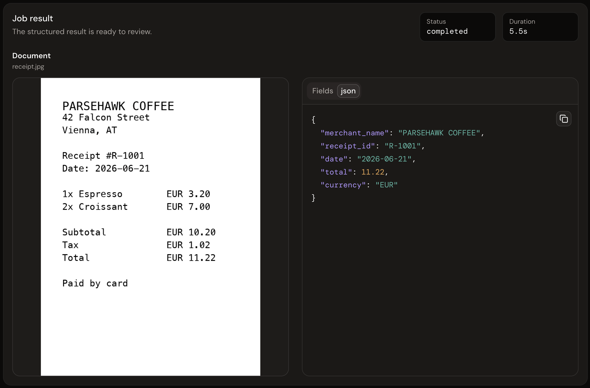
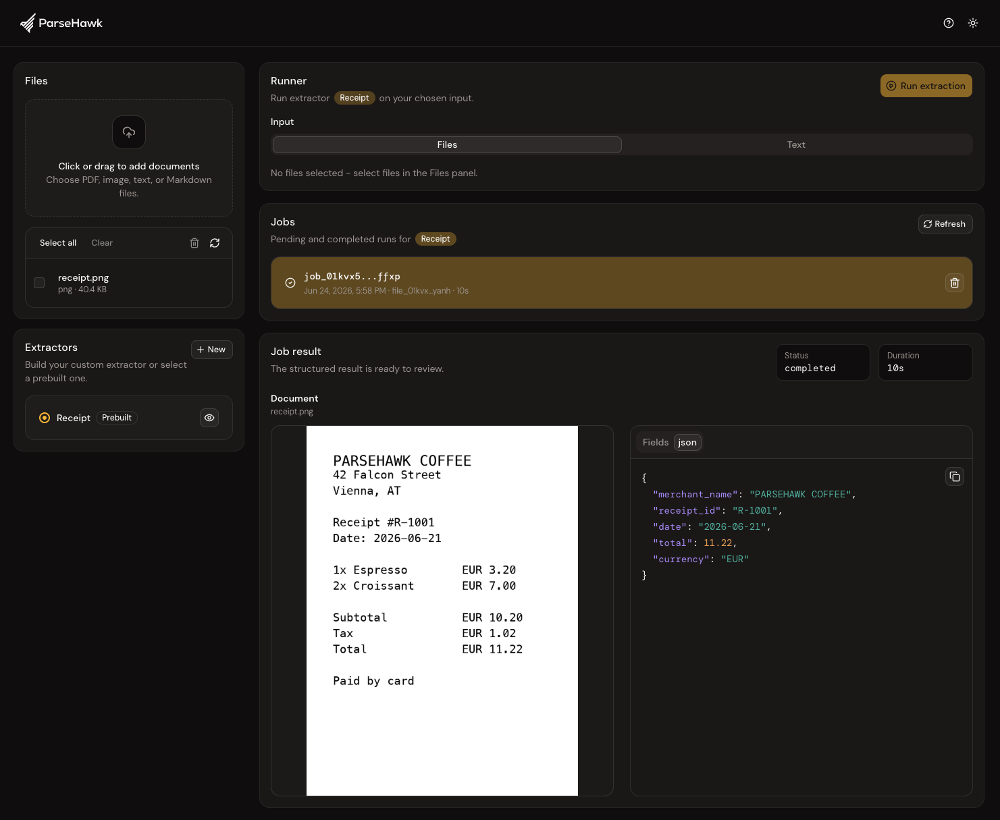
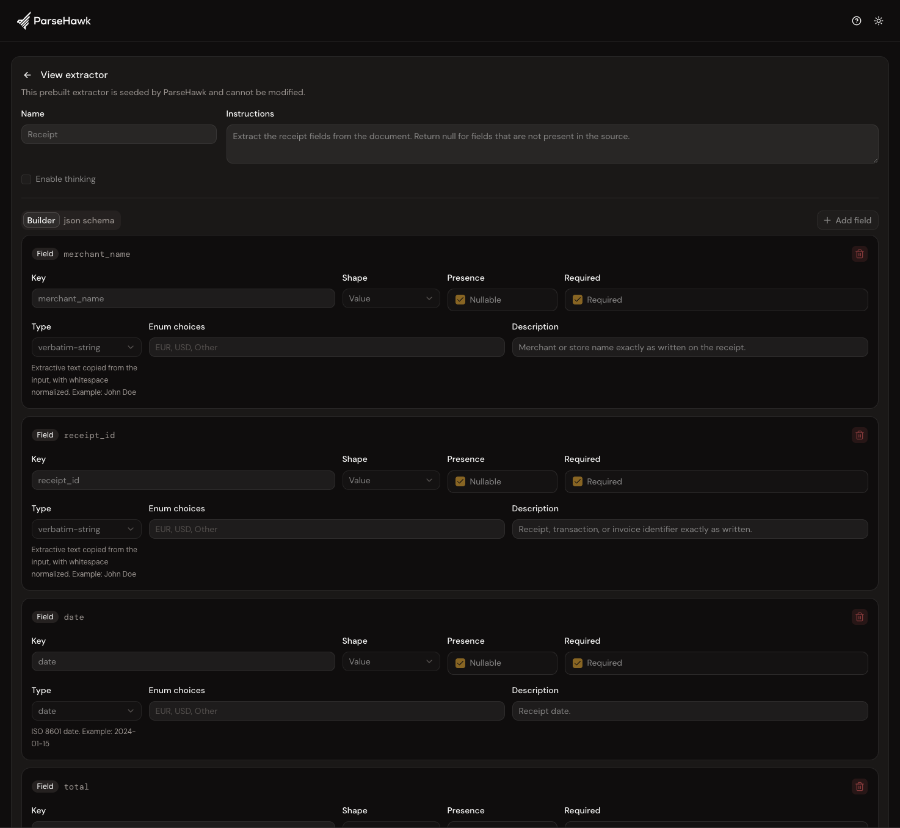

# ParseHawk

<p align="center">
  <picture>
    <source media="(prefers-color-scheme: light)" srcset="https://raw.githubusercontent.com/parsehawk/parsehawk/main/apps/web/src/assets/logo.svg">
    
  </picture>
</p>

<p align="center">
  <strong>Turn documents into structured JSON with local-first document AI. Run 100% locally by default, with API, CLI, and Web UI.</strong>
</p>

<p align="center">
  <a href="https://github.com/parsehawk/parsehawk/releases"></a>
  <a href="LICENSE"></a>
  <a href="pyproject.toml"></a>
  
  <a href="https://github.com/astral-sh/ruff"></a>
  
  <a href="https://github.com/parsehawk/parsehawk/stargazers"></a>
</p>

<p align="center">
  <a href="#quickstart">Quickstart</a> ·
  <a href="#first-extraction">First extraction</a> ·
  <a href="#api-cli-and-web-ui">API, CLI, and Web UI</a> ·
  <a href="#requirements">Requirements</a> ·
  <a href="#development">Development</a>
</p>

ParseHawk turns PDFs, scans, images, text files, and Markdown into structured
JSON without sending sensitive documents to a third-party AI API. It is built
for developers and teams working with private data: invoices, receipts,
contracts, internal documents, customer files, medical or financial records, and
other unstructured inputs that should stay under your control.

The default setup runs fully locally. ParseHawk uses vLLM on Linux NVIDIA
machines and vLLM Metal on macOS Apple Silicon, so you can run practical
document extraction on a server or even on your MacBook. You can drive the same
workflow from the browser, from `curl`, or from the `parsehawk` CLI.



## What You Get

- Extract structured JSON from unstructured PDFs, scans, images, text, and Markdown
- Define your own schemas for the data you want back
- Run zero-shot extraction with only instructions and a schema
- Add few-shot examples when a document type needs more guidance
- Improve extraction quality without training a model
- Improve extractors over time with better instructions, schemas, and examples
- Get validated JSON output using JSON Schema Draft 2020-12
- Keep files, jobs, extractors, and results local by default
- Use the Web UI for humans and the REST API or CLI for scripts, services, and agents
- Control both the local stack and the extraction API from one `parsehawk` CLI
- Run on Linux with vLLM or on macOS Apple Silicon with vLLM Metal

## Requirements

ParseHawk runs on macOS Apple Silicon and Linux x86_64 with an NVIDIA GPU.
Windows is not supported yet.

<details>
<summary>macOS Apple Silicon details</summary>

Required:

- `uv`
- Docker Desktop
- Xcode Command Line Tools
- Apple Silicon Mac with enough unified memory for NuExtract3-W4A16

Verified:

- MacBook Pro M3 Pro with 18 GB unified memory
- MacBook Pro M3 Pro with 36 GB unified memory

Recommended:

- 16 GB unified memory minimum for the default local workflow
- 32 GB or more for larger context lengths

</details>

<details>
<summary>Linux NVIDIA details</summary>

Required:

- `uv`
- Docker Engine
- Docker Compose
- NVIDIA driver
- NVIDIA Container Toolkit
- NVIDIA GPU with enough VRAM for NuExtract3-W4A16

Verified:

- NVIDIA L4 with 24 GB VRAM

Recommended:

- 16 GB VRAM minimum for the default local workflow
- 24 GB VRAM or more for larger context lengths

</details>

## Quickstart

Run ParseHawk from a Git checkout with
[`uv`](https://docs.astral.sh/uv/getting-started/installation/) and install the
CLI as an editable local tool:

```bash
git clone https://github.com/parsehawk/parsehawk.git
cd parsehawk
uv tool install --editable .
parsehawk start
```

Then open:

- Web UI: [http://127.0.0.1:5173](http://127.0.0.1:5173)
- API docs: [http://127.0.0.1:8000/docs](http://127.0.0.1:8000/docs)
- OpenAPI JSON: [http://127.0.0.1:8000/openapi.json](http://127.0.0.1:8000/openapi.json)

Stop ParseHawk:

```bash
parsehawk stop
```

Check your local setup:

```bash
parsehawk doctor
```

## First Extraction

The easiest first run is image-to-JSON extraction with the bundled receipt image
and the seeded prebuilt `Receipt` extractor.

### Option A: Web UI

1. Start ParseHawk with `parsehawk start`.
2. Open [http://127.0.0.1:5173](http://127.0.0.1:5173).
3. Upload [`tests/fixtures/receipt/receipt.jpg`](tests/fixtures/receipt/receipt.jpg).
4. Select the prebuilt `Receipt` extractor.
5. Select the uploaded file and click **Run extraction**.
6. Inspect the extracted fields and JSON result.

Expected fields include:

```json
{
  "merchant_name": "PARSEHAWK COFFEE",
  "receipt_id": "R-1001",
  "date": "2026-06-21",
  "total": 11.22,
  "currency": "EUR"
}
```

### Option B: CLI

```bash
parsehawk files upload tests/fixtures/receipt/receipt.jpg
parsehawk extractors list
parsehawk extract \
  tests/fixtures/receipt/receipt.jpg \
  --extractor extractor_... \
  --wait
```

Use the `Receipt` extractor ID from `extractors list`.

### Option C: API

```bash
API=http://127.0.0.1:8000

EXTRACTOR_ID=$(
  curl -s "$API/v1/extractors" |
    jq -r '.[] | select(.name=="Receipt" and .is_prebuilt==true) | .id'
)

FILE_ID=$(
  curl -s -X POST "$API/v1/files" \
    -F "upload=@tests/fixtures/receipt/receipt.jpg;type=image/jpeg" |
    jq -r '.id'
)

JOB_ID=$(
  curl -s -X POST "$API/v1/jobs" \
    -H "Content-Type: application/json" \
    -d "{\"extractor_id\":\"$EXTRACTOR_ID\",\"file_id\":\"$FILE_ID\"}" |
    jq -r '.id'
)

curl -s "$API/v1/jobs/$JOB_ID" | jq .
```

Jobs are asynchronous. Poll `GET /v1/jobs/{job_id}` until `status` is
`completed` or `failed`.

## API, CLI, And Web UI

ParseHawk exposes one local API. The CLI and Web UI are clients of that API.
The CLI has two jobs: it controls the local ParseHawk stack (`start`, `stop`,
`status`, `doctor`, `restart`) and it works with the data plane (`files`,
`extractors`, `schemas`, `jobs`, and one-shot `extract`).



Core resources:

```text
POST   /v1/files
GET    /v1/files
GET    /v1/files/{file_id}
GET    /v1/files/{file_id}/content
DELETE /v1/files/{file_id}

POST   /v1/schemas/validate

POST   /v1/extractors
GET    /v1/extractors
GET    /v1/extractors/{extractor_id}
PATCH  /v1/extractors/{extractor_id}
DELETE /v1/extractors/{extractor_id}

POST   /v1/jobs
GET    /v1/jobs
GET    /v1/jobs/{job_id}
DELETE /v1/jobs/{job_id}
```

Jobs return the canonical extracted JSON inline as `job.result.data` once
completed.

Useful CLI commands:

```bash
parsehawk files upload document.pdf
parsehawk files list
parsehawk schemas validate schema.json
parsehawk extractors create --name invoice_v1 --schema schema.json --instructions "Extract invoice fields."
parsehawk jobs create --extractor extractor_... --file-id file_...
parsehawk jobs get job_...
parsehawk extract document.pdf --schema schema.json --instructions "Extract invoice fields." --wait
```

Public IDs are TypeID-style strings with resource prefixes such as `file_...`,
`extractor_...`, and `job_...`.

## Extractors And Schemas

An extractor combines:

- a name
- natural-language instructions
- JSON Schema Draft 2020-12
- optional few-shot examples
- optional thinking mode



A minimal extractor schema:

```json
{
  "type": "object",
  "properties": {
    "invoice_number": {
      "type": ["string", "null"],
      "description": "The invoice number exactly as shown on the document."
    },
    "total_amount": {
      "type": ["number", "null"],
      "description": "The final total amount to pay."
    }
  },
  "required": ["invoice_number", "total_amount"],
  "additionalProperties": false
}
```

Few-shot examples can use inline text or uploaded files:

```json
{
  "name": "invoice_v1",
  "instructions": "Extract the invoice fields exactly.",
  "schema": {
    "type": "object",
    "properties": {
      "invoice_number": { "type": ["string", "null"] }
    },
    "required": ["invoice_number"],
    "additionalProperties": false
  },
  "examples": [
    {
      "input": { "type": "text", "text": "Invoice #A-123" },
      "output": { "invoice_number": "A-123" }
    },
    {
      "input": { "type": "file", "file_id": "file_..." },
      "output": { "invoice_number": "B-456" }
    }
  ]
}
```

ParseHawk validates model output against the schema and stores the canonical
result under `job.result.data`.

The schema dialect is documented in
[`docs/schemas/parsehawk-extraction-schema.schema.json`](docs/schemas/parsehawk-extraction-schema.schema.json).
It supports JSON Schema plus optional `x-parsehawk.semantic` metadata for
NuExtract3-oriented scalar hints.

## Runtime Defaults

The default model is:

```text
numind/NuExtract3-W4A16
```

ParseHawk talks to the runtime through an OpenAI-compatible API. On macOS, the
runtime runs on the host through vLLM Metal because Metal acceleration is not
available inside a normal Linux container. On Linux, the runtime runs as part
of Docker Compose.

Current defaults:

| Setting | Default |
| --- | --- |
| vLLM package | `vllm==0.23.0` |
| Linux runtime image | `vllm/vllm-openai:v0.23.0` |
| Model | `numind/NuExtract3-W4A16` |
| GPU memory utilization | platform- and memory-tier specific |
| Max model length | platform- and memory-tier specific |
| Max concurrent sequences | platform- and memory-tier specific |
| PDF render DPI | `170` |
| PDF max pages | `25` |

For known bundled models, ParseHawk chooses conservative runtime defaults from
the detected platform and memory tier. Apple Silicon uses unified memory; Linux
uses NVIDIA GPU VRAM. These defaults favor reliable local startup over maximum
throughput. Increase the context length, memory utilization, or concurrent
sequence limit manually if you are running on a larger machine.

Common overrides:

```bash
PARSEHAWK_VLLM_MAX_MODEL_LEN=16384 parsehawk start
PARSEHAWK_VLLM_GPU_MEMORY_UTILIZATION=0.6 parsehawk start
PARSEHAWK_VLLM_MAX_NUM_SEQS=4 parsehawk start
PARSEHAWK_VLLM_MODEL=numind/NuExtract3-W4A16 parsehawk start
PARSEHAWK_VLLM_IMAGE=vllm/vllm-openai:v0.23.0 parsehawk start
```

## Configuration

ParseHawk uses Pydantic settings. Common environment variables:

| Environment variable | Default | Description |
| --- | --- | --- |
| `PARSEHAWK_DATA_DIR` | `data` | Local storage directory for SQLite, uploaded files, logs, and local state. |
| `PARSEHAWK_DATABASE_PATH` | `data/parsehawk.db` | SQLite database path. |
| `PARSEHAWK_LOG_LEVEL` | `INFO` | Log level for API, worker, runtime, and Web UI logs. |
| `PARSEHAWK_LOG_MODEL_IO` | `false` | When `true` and `PARSEHAWK_LOG_LEVEL=DEBUG`, log model-runtime request and response JSON from the API/worker process. Image data URLs are redacted. |
| `PARSEHAWK_INFERENCE_ENGINE` | `none` | API/worker inference engine. `parsehawk start` sets this to `vllm` when a runtime is configured. |
| `PARSEHAWK_VLLM_BASE_URL` | `http://127.0.0.1:8080/v1` | OpenAI-compatible model runtime URL. |
| `PARSEHAWK_VLLM_MODEL` | `numind/NuExtract3-W4A16` | Model name sent to the runtime. |
| `PARSEHAWK_VLLM_MAX_MODEL_LEN` | platform-specific | vLLM context length. Overrides the automatic runtime-profile default. |
| `PARSEHAWK_VLLM_MAX_NUM_SEQS` | platform-specific | vLLM maximum concurrent decode sequences. Overrides the automatic runtime-profile default. |
| `PARSEHAWK_VLLM_GPU_MEMORY_UTILIZATION` | platform-specific | vLLM memory reservation fraction. On Apple Silicon this is also mapped to `VLLM_METAL_MEMORY_FRACTION`. |
| `PARSEHAWK_VLLM_IMAGE` | `vllm/vllm-openai:v0.23.0` | Linux Docker runtime image. |
| `PARSEHAWK_VLLM_CACHE_HOME` | `~/.cache/vllm` | Linux host cache for vLLM compile artifacts. |
| `PARSEHAWK_PDF_MAX_PAGES` | `25` | Maximum PDF pages rendered for one extraction. |
| `PARSEHAWK_PDF_RENDER_DPI` | `170` | PDF page image render DPI. |
| `PARSEHAWK_TELEMETRY_DISABLED` | `false` | When truthy, disables anonymous usage analytics. |

CLI config:

```bash
parsehawk config list
parsehawk config set log.level DEBUG
parsehawk restart
```

## Telemetry

ParseHawk collects **anonymous usage analytics**. Two events are sent to
[PostHog](https://posthog.com):

- `install` — once per install, the first time you start ParseHawk.
- `run_started` — each time a user starts an extraction run.

Each event carries only coarse, non-identifying data:

- a random per-install id stored in `data/telemetry-id`
- the input type (`file` or `text`, on runs)
- the ParseHawk version and your operating system name
- an approximate location (country/region)

ParseHawk never sends file contents, file names, extractor instructions,
schemas, or extracted data, and it never creates a personal profile from the
per-install id. The first time you run `parsehawk start` or `parsehawk dev`, you
will see a notice describing this.

To opt out, set either of these before starting ParseHawk:

```bash
export PARSEHAWK_TELEMETRY_DISABLED=1
export DO_NOT_TRACK=1
```

When ParseHawk runs in Docker, these variables are passed through to the API and
worker containers automatically.

Maintainers can tag internal usage instead of dropping it:

```bash
export PARSEHAWK_TELEMETRY_INTERNAL=1
```

## Local Data

By default ParseHawk stores local state under `data/`:

```text
data/
  parsehawk.db
  files/
  logs/
  parsehawk-state.json
  telemetry-id
```

Stop ParseHawk before deleting `data/`:

```bash
parsehawk stop
rm -rf data
parsehawk start
```

If `data/` is deleted while ParseHawk is still running, old processes can keep
serving from already-open SQLite handles. `parsehawk start` refuses to start
when target ports are already occupied without a live state file. In that case,
stop the process using the port and start again.

## Development

Development requires:

- `git`
- `just`
- `uv`
- `pnpm`

Useful commands:

```bash
just setup          # install dependencies and pre-commit hooks
just start          # product-like Docker mode
just dev            # local-source development mode
just web-dev        # Web UI dev server only
just smoke          # local smoke flow
just test           # Python tests
just e2e            # local end-to-end API tests (needs the model runtime up)
just format         # format Python
just lint           # Ruff linting
just typecheck      # ty type checking
just web-typecheck  # TypeScript checks
just web-test       # Web UI tests
just web-build      # production Web UI build
just check          # all standard checks
just hooks-run      # run pre-commit on all files
```

Pre-commit hooks are not installed automatically by Git. Run this once per
clone:

```bash
just setup
```

The hooks run Ruff, ty, Python tests, Web UI typecheck, and Web UI tests. CI
should still run the same checks; hooks are just the fast local feedback loop.

#### Development mode:

Includes hot reload for the web UI.

```bash
parsehawk dev   
```

```bash
parsehawk dev --runtime none  # starts the API and Web UI without local inference
```

#### Product-like local mode:

```bash
parsehawk start
```

```bash
parsehawk start --runtime none  # starts the API and Web UI without local inference
```

## Troubleshooting

Start with the built-in health checks:

Check status:

```bash
parsehawk status
```

Read logs:

```bash
ls data/logs
tail -f data/logs/api.log
tail -f data/logs/worker.log
tail -f data/logs/runtime.log
```

Restart:

```bash
parsehawk restart
```

If Docker or the runtime gets into a strange state, stop ParseHawk before
removing local data:

```bash
parsehawk stop
rm -rf data
parsehawk start
```

If the Model Runtime is slow to become ready, give it a few minutes on first
startup while vLLM loads model weights, profiles memory, and warms kernels.

## Credits

ParseHawk stands on excellent open-source projects, including:

- [FastAPI](https://github.com/fastapi/fastapi) for the API framework and OpenAPI docs
- [vLLM](https://github.com/vllm-project/vllm) and [vLLM Metal](https://github.com/vllm-project/vllm-metal) for local model serving
- [NuExtract3](https://huggingface.co/numind/NuExtract3-W4A16) for the default extraction model
- [Pydantic](https://github.com/pydantic/pydantic), [Ruff](https://github.com/astral-sh/ruff), and [uv](https://github.com/astral-sh/uv) for the Python toolchain
- [React](https://github.com/facebook/react), [Vite](https://github.com/vitejs/vite), and [Tailwind CSS](https://github.com/tailwindlabs/tailwindcss) for the Web UI

## Roadmap

Near-term focus:

- make the macOS and Linux runtime paths boringly reliable
- publish an installable CLI package
- improve the Web UI schema builder
- add stronger end-to-end runtime smoke tests
- document deployment options for VPS and container platforms

Later:

- Python SDK
- migrations and PostgreSQL support
- batch extraction
- review/correction workflows
- eval tooling
- bring-your-own OpenAI-compatible runtime

## Enterprise

ParseHawk is developed by Totoy GmbH in Vienna, Austria. If you are interested
in an enterprise deployment, private-cloud setup, or managed infrastructure for
sensitive document workflows, contact [support@totoy.ai](mailto:support@totoy.ai).

## Versioning

ParseHawk follows SemVer.

Until `v1.0.0`, ParseHawk is in developer preview. Breaking changes may happen
in any minor release, for example from `v0.1.0` to `v0.2.0`.

Patch releases, such as `v0.1.1`, are intended to be backward-compatible bug
fixes for that minor line.

We will move to `v1.0.0` once the core CLI commands, the REST API, and the
config file format are stable enough for users to rely on.

## License

ParseHawk is open source under the Apache-2.0 license. See [`LICENSE`](LICENSE).

Third-party dependencies retain their own licenses.
